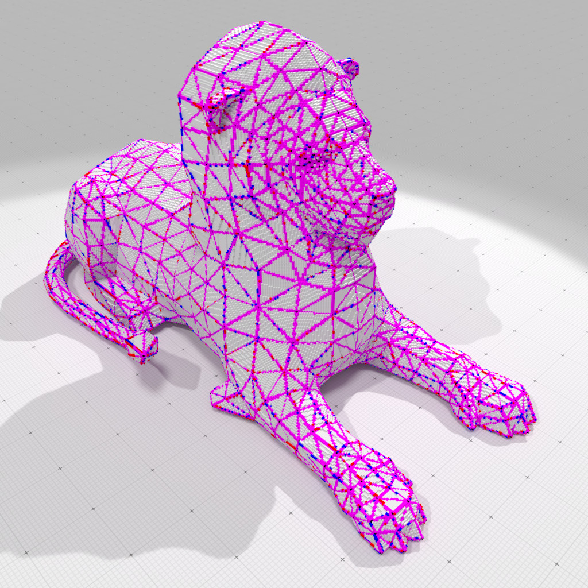

We are thrilled to announce the [release  1.3 of DGtal](https://github.com/DGtal-team/DGtal/releases/tag/1.3) and its tools. Many new features, edits and bugfixes are listed in the [Changelog](https://github.com/DGtal-team/DGtal/blob/master/ChangeLog.md), and we would like to thank all devs involved in this release. In this short review, we would like to only focus on selected new features.

* **Geometry processing**: many new features for the geometry processing of digital objects and surfaces
  * a new [differential calculus framework](https://dgtal-team.github.io/doc-nightly/modulePolygonalCalculus.html) for polygonal meshes and digital surfaces (scalar field and vector field processing on surfaces)

<table border="0">
<tr>
<td markdown="span"> </td><td markdown="span"> </td><td markdown="span"> </td>
</tr>
</table>

  * Faster digital convexity tests in the [convexity module](https://dgtal.org/doc/stable/moduleDigitalConvexity.html), and a brand new fully convex digital [envelope module](https://dgtal-team.github.io/doc-nightly/moduleEnvelope.html), allowing a new convexity based definition of digital polyhedra.

<table border="0">
<tr>
<td markdown="span"> </td><td markdown="span">   </td>
</tr>
</table>

* **Volumetric analysis**: now the volumetric tools contains a new [VoronoiMapComplete](https://dgtal-team.github.io/doc-nightly/moduleVolumetric.html#vorocomplete) class that outputs the complete restriction to $\mathbb{Z}^d$ of the Voronoi diagram is a set of grid points (i.e. with all co-cyclic sites).

* Many improvements in the build system.

Do not forget to have a look to the [DGtal @ DGMM 2022 tutorials](https://dgtal.org/2022-11-06-dgtal-dgmm/).
