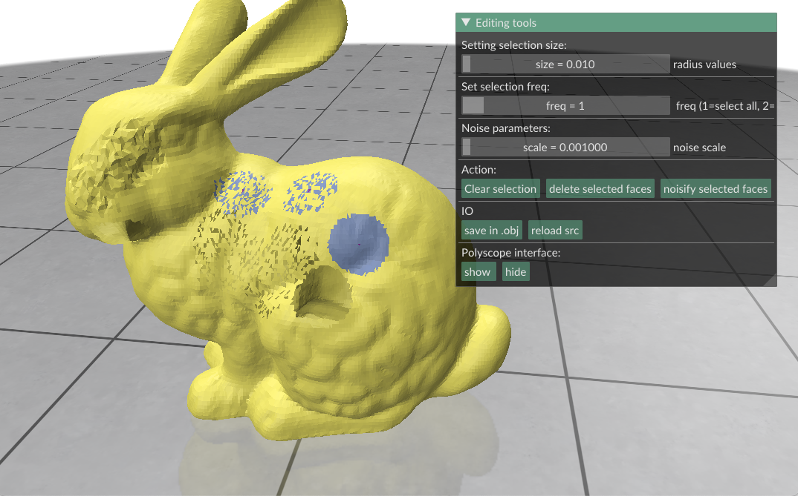

We are happy to announce the [release  1.4 of DGtal](https://github.com/DGtal-team/DGtal/releases/tag/1.4) and its tools. As always,many new features, edits and bugfixes are listed in the [Changelog](https://github.com/DGtal-team/DGtal/blob/master/ChangeLog.md), and we would like to thank all devs involved in this release. In this short review, we would like to only focus on selected new features.

* **New Features**:
  * [Implicit shapes](https://dgtal-team.github.io/doc-nightly/moduleWinding.html) can be constructed from points clouds using generalized winding numbers from [libIGL](https://libigl.github.io).
  * `SurfaceMesh` instances can be updated through [flip operations](https://dgtal-team.github.io/doc-nightly/moduleSurfaceMesh.html#SurfMesh_sec8).
  * [Lattice polytopes](https://dgtal-team.github.io/doc-nightly/moduleDigitalConvexity.html) describing segments or triangles can be constructed in a much more efficient manner.
  * Update of the [Discrete Polygonal Calculus](https://dgtal-team.github.io/doc-nightly/modulePolygonalCalculus.html) module to construct a calculus on a corrected geometry (when the discrete tangent planes are given by  user-provided normal vectors).
  * A brand new style for the [DGtal documentation](https://dgtal-team.github.io/doc-nightly/index.html).
  * DGtal now requires C++17 compilers.

* **DGtalTools/DGtalTools-contrib**:
  * New `volscope` tool in DGtalTools for quick visualization of VOL files.
  * New tools to edit and color meshes in DGtaltools-contrib (`polyMeshEdit` and `polyMeshColorize`)
<table border="0">
<tr>
<td markdown="span"> </td><td markdown="span">   </td><td markdown="span">   </td>
</tr>
</table>

* **Project Managment**. Many updates of the DGtal repository: new documentation style, new CI and deploy bots for the python binding (using Github Actions), easier build on Windows, many bug and warning fixes...

**Links:**

  * DGtal 1.4: [http://dgtal.org/download/](http://dgtal.org/download)
  * Complete changelogs:
      * [https://github.com/DGtal-team/DGtal/blob/master/ChangeLog.md](https://github.com/DGtal-team/DGtal/blob/master/ChangeLog.md)
      * [https://github.com/DGtal-team/DGtalTools/blob/master/ChangeLog.md](https://github.com/DGtal-team/DGtalTools/blob/master/ChangeLog.md)
      * [https://github.com/DGtal-team/DGtalTools-contrib/blob/master/ChangeLog.md](https://github.com/DGtal-team/DGtalTools-contrib/blob/master/ChangeLog.md)

  * DGtalTools 1.4 [http://dgtal.org/tools/](http://dgtal.org/tools/)
  * DGtalTools-contrib 1.4: [http://dgtal.org/tools/](http://dgtal.org/tools/)
  * DGtal Documentation: [http://dgtal.org/doc/stable](http://dgtal.org/doc/stable)
  * DGtalTools documentation:  [http://dgtal.org/doc/tools/stable](http://dgtal.org/doc/tools/stable)
  * DGtalTools-contrib: [https://github.com/DGtal-team/DGtalTools-contrib](https://github.com/DGtal-team/DGtalTools-contrib)
