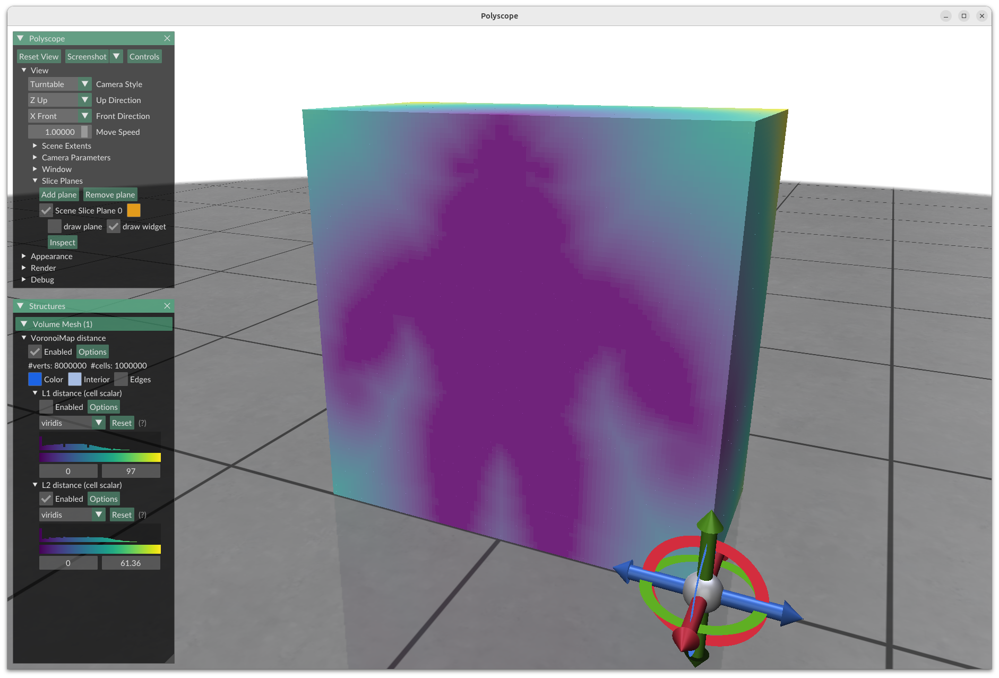
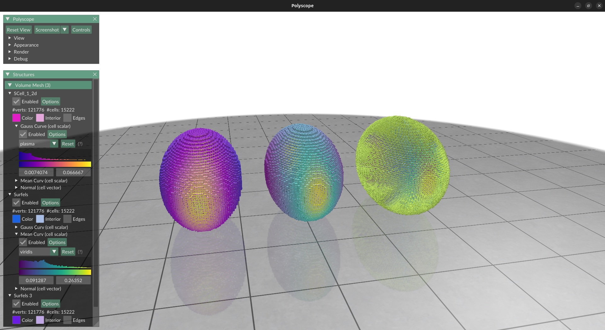
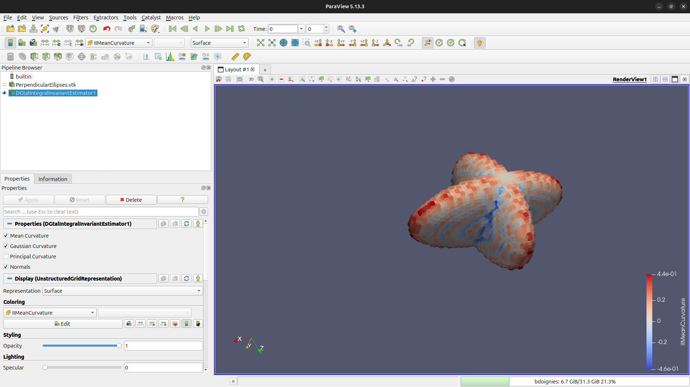

We are happy to announce the major release 2.0 of DGtal. This big update makes the library more modern, in both how it is built and the tools it uses. This release also includes new features in both the C++ library and its python binding. Let us take a look at the big changes (see more in the [Changelog](https://github.com/DGtal-team/DGtal/blob/master/ChangeLog.md) section).


## New Polyscope-based viewer
The new version of DGtal (2.0) includes a brand new viewer that is based on [Polyscope](https://polyscope.run/). This modern viewer lets you customise things like colors, transforms, clipping planes and more while you're using it. This is also the perfect time to make the viewer's code simpler and easier to use. A [guide](https://dgtal-team.github.io/doc-nightly/migratingViewer3D.html) is available to help you adapt old codes to the new viewer. 

 Digital surfaces | Distance transformation | Diff. Estimators
--|--|--
 |  | 


## DGtal Paraview Plugin

DGtal now has a plugin for [paraview](http://paraview.org)  which is available at [https://github.com/DGtal-team/DGtal-paraview](https://github.com/DGtal-team/DGtal-paraview). The main motivation is to use DGtal geometry processing tools in a VTK/Paraview pipeline, widely used in scientific data visualization (medical imagine, material sciences...). For now, this plugin binds most of the Shortcuts and Geometry Shortcuts with a mapping between DGtal and vtk/paraview voxel-based objects.

 


## New Geometry Shortcuts

* Shortcuts are now available for Corrected Normal Current curvature tensor estimators estimators.
* The Geometry Shortcuts now contain volumetric processing tools (Distance transformation and Voronoi maps)

## Updated Python Bindings

* Shortcuts are also available in the Python wrapper.


``` python
from dgtal import *
from dgtal import SH3
import polyscope as ps
import numpy as np
 
params = SH3.defaultParameters()
al_capone = SH3.makeBinaryImage("Al.100.vol", params)
K = SH3.getKSpace(al_capone, params)
surface = SH3.makeLightDigitalSurface(al_capone, K, params)
surfels = SH3.getSurfelRange(surface, params)
 
normals = SH3.getIINormalVectors(al_capone, surfels, params)
meanCurvs  = SH3.getIIMeanCurvatures(al_capone, surfels, params)
gaussCurvs = SH3.getIIGaussianCurvatures(al_capone, surfels, params)
 
# Display information with polyscope 
points  = pos[:, np.newaxis, :] + cubes
points  = points.reshape(len(pos) * 8 , 3)
indices = np.arange(len(pos) * 8).reshape(len(pos), 8)
ps.init()
vmesh = ps.register_volume_mesh("Al", points, hexes=indices)
vmesh.add_scalar_quantity("Mean Curvature", np.asarray(meanCurvs), defined_on='cells', enabled=False)
vmesh.add_scalar_quantity("Gaussian Curvature", np.asarray(gaussCurvs), defined_on='cells', enabled=True)
vmesh.add_vector_quantity("Normals", np.asarray(normals), defined_on='cells', enabled=True)
ps.show()
```

## Building the library
* DGtal now uses more modern CMake scripts, which involves creating sublibraries in a top-down structure.
* All DGtal CMake variables now have the prefix "DGTAL_".
* Most dependencies are now available through FetchContent, so the user doesn't need to pre-install them at the correct location or specify any path. This version includes:
  * [Boost](https://www.boost.org/)
  * [Eigen](https://eigen.tuxfamily.org/index.php?title=Main_Page)
  * [Ponca](https://poncateam.github.io/ponca/index.html)
  * [Polyscope](https://polyscope.run/) (see viewer section below)
* `Patate` was upgraded to [Ponca](https://poncateam.github.io/ponca/index.html) for point cloud based differential estimators.
* `GMP` is no longer used; instead, we only rely on  Boost Multiprecision (with its own backend) for arbitrary precision integers  (enabled by default).
* `Qt` and `libqglviewer` are no longer required for the viewer.
* CI and CD are now built on top of actions that can be reused. These actions are used with side repositories.

## Breaking Changes
The new minimal standard is now C++20, which replaced the previous standard of C++14. This has a few impacts. Some of the side effects of DGtal that you might notice are:
* You can no longer convert enums to int.
* Old `std::allocator` API is being removed (this was used in MPolynomial).
* New code might not work with older versions because it uses new libraries and language features.
* Removal of the deprecated namespace. Classes, functions and variables inside this namespace are no longer accessible. This is mostly about convolution on surfaces, which is now replaced with `LocalEstimatorFromSurfelFunctorAdapter`.
* The Viewer is now based on Polyscope (see the section above for more details). The stream API was kept the same, but most of the modifiers were taken out. See the [Migrating viewer page](https://dgtal-team.github.io/doc-nightly/migratingViewer3D.html).


## Links

  * [Discord server](https://discord.gg/zTyCYdfA)
  * DGtal 2.0: [http://dgtal.org/download/](http://dgtal.org/download)
  * Complete changelogs:
      * [https://github.com/DGtal-team/DGtal/blob/master/ChangeLog.md](https://github.com/DGtal-team/DGtal/blob/master/ChangeLog.md)
      * [https://github.com/DGtal-team/DGtalTools/blob/master/ChangeLog.md](https://github.com/DGtal-team/DGtalTools/blob/master/ChangeLog.md)
      * [https://github.com/DGtal-team/DGtalTools-contrib/blob/master/ChangeLog.md](https://github.com/DGtal-team/DGtalTools-contrib/blob/master/ChangeLog.md)

  * DGtalTools 2.0: [http://dgtal.org/tools/](http://dgtal.org/dgtaltools/)
  * DGtalTools-contrib 2.0: [http://dgtal.org/tools/](http://dgtal.org/dgtaltools/)
  * DGtal Documentation: [http://dgtal.org/doc/stable](http://dgtal.org/doc/stable)
  * DGtalTools documentation:  [http://dgtal.org/doc/tools/stable](http://dgtal.org/doc/tools/stable)
  * DGtalTools-contrib: [https://github.com/DGtal-team/DGtalTools-contrib](https://github.com/DGtal-team/DGtalTools-contrib)
