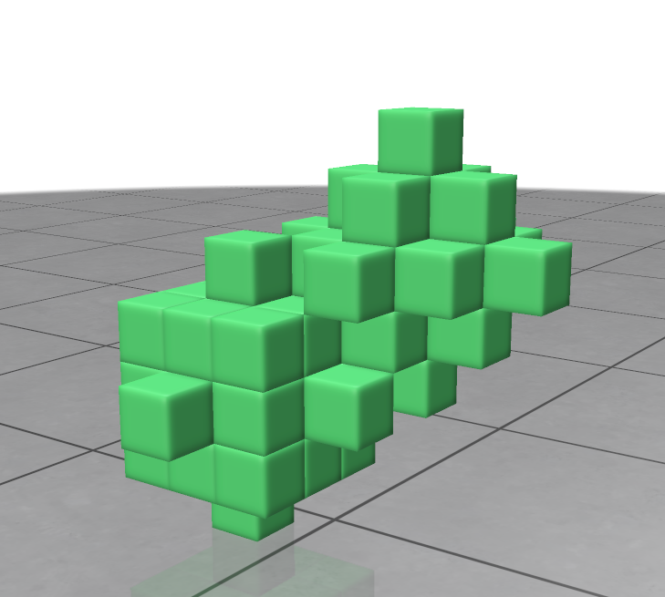
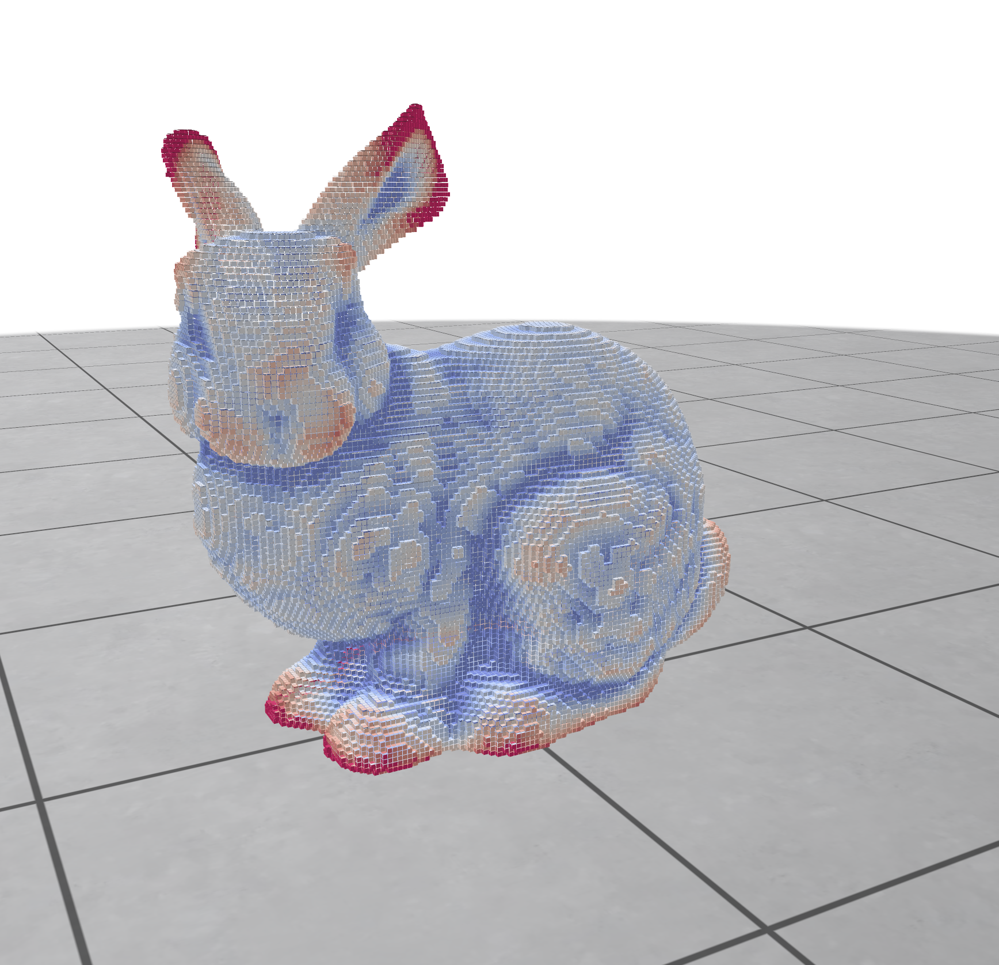

We are happy to announce the release 2.2 of DGtal. This release is a minor update of the library with new contributions and improvements to the build system (see more details in the [Changelog](https://github.com/DGtal-team/DGtal/blob/master/ChangeLog.md) section):

* We have upgraded the internal viewer to support the latest version of polyscope (2.6.1) allowing efficent vizualization of voxel sets (SparseVolumeGrid).

* A new parallel version of the Integral Invariant curvature estimator has been added to the library (multhreading support using OpenMP). In addition to recent Sparse Voxel Octrees (SVO) support, this new version allows to compute differential quantities on large voxel sets in a reasonable time.

Mean curvature | Mean curvature in parallel
--|--
 |   

* Many bug fixes and improvements have been made to the build system and the documentation.

## Links

  * [Discord server](https://discord.gg/zTyCYdfA)
  * DGtal 2.2: [http://dgtal.org/download/](http://dgtal.org/download)
  * Complete changelogs:
      * [https://github.com/DGtal-team/DGtal/blob/main/ChangeLog.md](https://github.com/DGtal-team/DGtal/blob/master/ChangeLog.md)
      * [https://github.com/DGtal-team/DGtalTools/blob/master/ChangeLog.md](https://github.com/DGtal-team/DGtalTools/blob/master/ChangeLog.md)
      * [https://github.com/DGtal-team/DGtalTools-contrib/blob/master/ChangeLog.md](https://github.com/DGtal-team/DGtalTools-contrib/blob/master/ChangeLog.md)

  * DGtalTools: [http://dgtal.org/tools/](http://dgtal.org/dgtaltools/)
  * DGtalTools-contrib: [http://dgtal.org/tools/](http://dgtal.org/dgtaltools/)
  * DGtal Documentation: [http://dgtal.org/doc/stable](http://dgtal.org/doc/stable)
  * DGtalTools documentation:  [http://dgtal.org/doc/tools/stable](http://dgtal.org/doc/tools/stable)
  * DGtalTools-contrib: [https://github.com/DGtal-team/DGtalTools-contrib](https://github.com/DGtal-team/DGtalTools-contrib)
