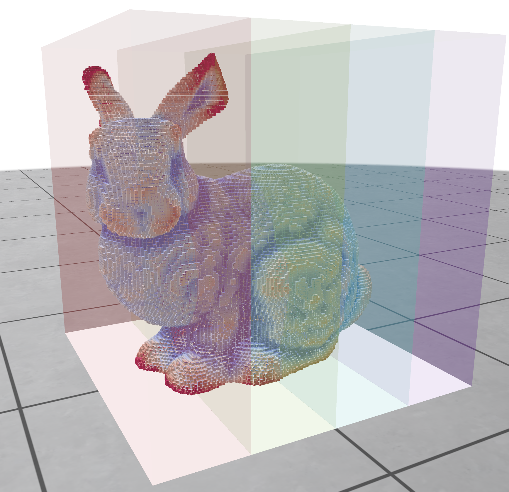

We are happy to announce the release 2.2 of DGtal. This release is a minor update of the library with new contributions and improvements to the build system (see more details in the [Changelog](https://github.com/DGtal-team/DGtal/blob/master/ChangeLog.md) section):

WIP

Mean curvature | Mean curvature in parallel
-- | --
  |  

## Links

  * [Discord server](https://discord.gg/zTyCYdfA)
  * DGtal 2.2: [http://dgtal.org/download/](http://dgtal.org/download)
  * Complete changelogs:
      * [https://github.com/DGtal-team/DGtal/blob/main/ChangeLog.md](https://github.com/DGtal-team/DGtal/blob/master/ChangeLog.md)
      * [https://github.com/DGtal-team/DGtalTools/blob/master/ChangeLog.md](https://github.com/DGtal-team/DGtalTools/blob/master/ChangeLog.md)
      * [https://github.com/DGtal-team/DGtalTools-contrib/blob/master/ChangeLog.md](https://github.com/DGtal-team/DGtalTools-contrib/blob/master/ChangeLog.md)

  * DGtalTools: [http://dgtal.org/tools/](http://dgtal.org/dgtaltools/)
  * DGtalTools-contrib: [http://dgtal.org/tools/](http://dgtal.org/dgtaltools/)
  * DGtal Documentation: [http://dgtal.org/doc/stable](http://dgtal.org/doc/stable)
  * DGtalTools documentation:  [http://dgtal.org/doc/tools/stable](http://dgtal.org/doc/tools/stable)
  * DGtalTools-contrib: [https://github.com/DGtal-team/DGtalTools-contrib](https://github.com/DGtal-team/DGtalTools-contrib)
